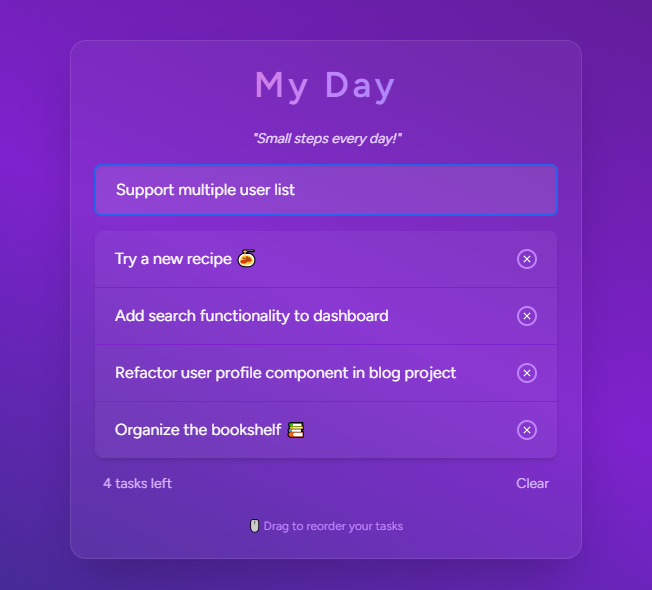

# 🧠 Todo App — Laravel + React + Inertia.js

A modern, full-stack Todo application built using **Laravel**, **React**, and **Inertia.js**.  
No APIs. No reloads. Just a smooth single-page experience — powered by Laravel and React working together seamlessly.

---

## ✨ Features

- ✅ Add / Edit / Delete / Bulk delete todos
- ⚡ Live updates without page reloads (Inertia-powered)
- 🎨 Clean & responsive UI with Tailwind CSS
- 🚀 Fast build with Vite

---

## 🛠️ Tech Stack

- **Backend**: Laravel 12
- **Frontend**: React + Inertia.js
- **Styling**: Tailwind CSS
- **Build Tool**: Vite

---
## ⚙️ Installation
1. **Clone the repository**

```bash
git clone https://github.com/rawat9015/laravel-react-todo.git
cd laravel-react-todo

# Install backend dependencies
composer install

# Install frontend dependencies
npm install

# Setup .env file
cp .env.example .env
php artisan key:generate

# Configure your database in .env, then run:
php artisan migrate

# Run the dev servers
npm run dev
php artisan serve
```

Now visit http://localhost:8000/todos

### Project Structure Highlights

#### React components (e.g. Todos.jsx)
├── resources/js/Pages/ 

#### Inertia + React setup

├── resources/js/Pages/app.jsx

#### Laravel routes
├── routes/web.php 

#### TodoController
├── app/Http/Controllers/ 


### Screenshots


### Future Ideas
🔐 Add authentication

🗂️ Support multiple user lists

📅 Add due dates and filters

📲 Mobile-friendly improvements

## Author
Neha Rawat

GitHub:[ @rawat9015](https://github.com/rawat901)

